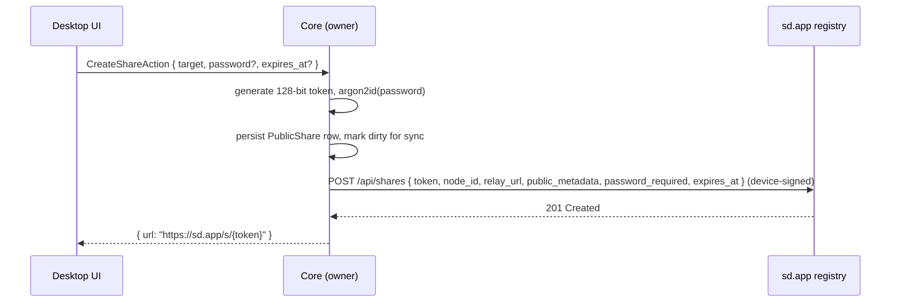
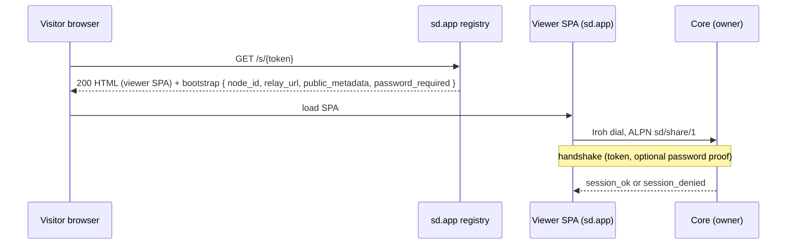
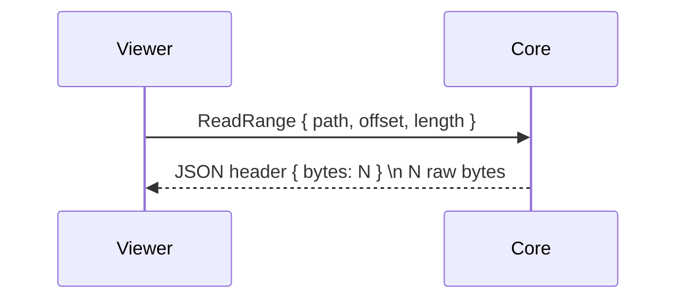
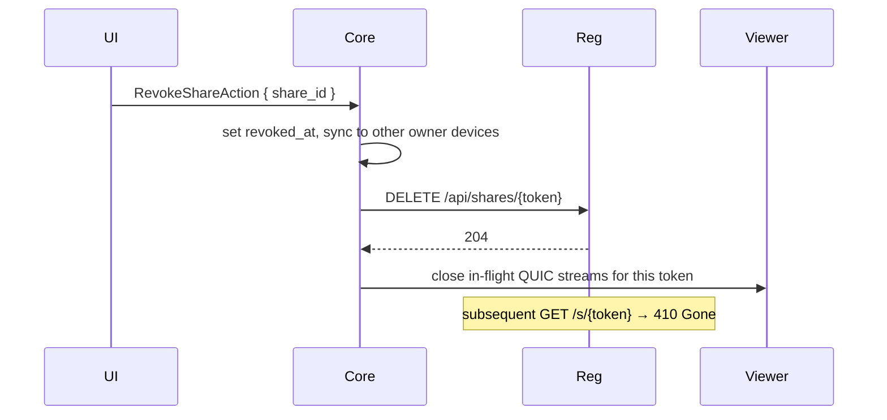
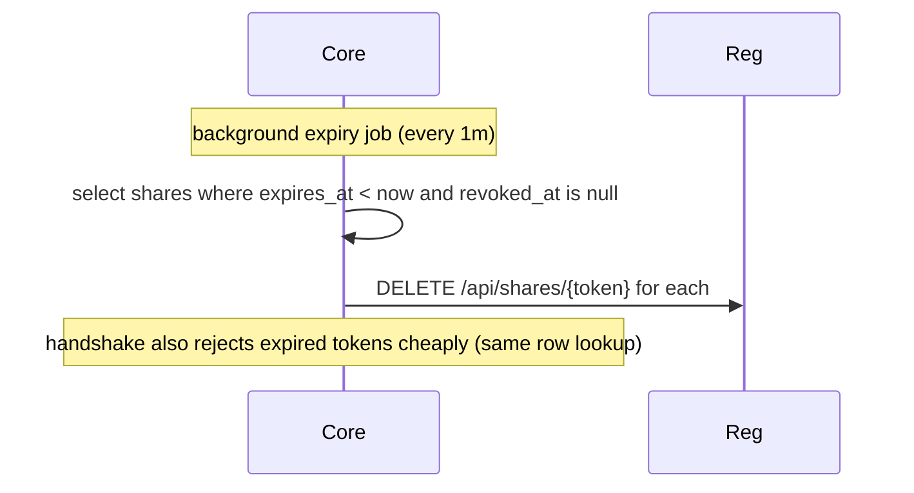

# Public Shares via sd.app

Status: draft for review. Source-of-truth contract between core (this repo) and the sd.app cloud service (separate repo).

## What this is

A user picks a Space, file, folder, or multi-selection in their local Spacedrive and creates a public share. They get a link of the form `https://sd.app/s/{token}`. Anyone with the link can open it in a browser, browse the listing, and stream/download files. Bytes are served directly from the user's core through an Iroh QUIC connection over an sd.app-operated relay — sd.app never proxies file content.

This document specifies the wire contracts and lifecycle. UX (`SHARE-009` / `SHARE-010`), schema (`SHARE-002`), ops (`SHARE-003`), and protocol handler (`SHARE-005`) tasks build against this spec.

## Decided architecture

- **Bytes path**: direct dial. Browser viewer dials the owner's `iroh::Endpoint` over QUIC, transiting an sd.app relay only when hole-punching fails. Bytes do not flow through sd.app application servers.
- **sd.app responsibilities** (separate repo):
  1. Iroh relay infrastructure (replaces the n0 default relay for hosted clients)
  2. Share registry — maps `token → {node_id, relay_url, public_metadata}`
  3. Viewer SPA served at `sd.app/s/{token}`
  4. User accounts that bind one or more device keys to an `account_id`
- **Core responsibilities** (this repo):
  1. `PublicShare` entity, sync across owner devices
  2. Share CRUD library actions
  3. Guest protocol handler on a new ALPN
  4. Heartbeat + revoke calls to the sd.app registry
- **Trust boundary**: sd.app is treated as untrusted for content confidentiality. It learns the token, the public metadata the owner chose to expose, and the relay-level dial info. It does not learn share contents. Password proofs are HMAC-based; passwords never reach sd.app.

## Actors

```
[Owner desktop]      [sd.app cloud]              [Visitor browser]
    core              registry + viewer            iroh-js + viewer SPA
      |                    |                              |
      | publish share      |                              |
      |------------------->|                              |
      |                    |   GET /s/{token}             |
      |                    |<-----------------------------|
      |                    |   dial info + metadata       |
      |                    |----------------------------->|
      |                    |                              |
      |     QUIC over Iroh relay (ALPN sd/share/1)        |
      |<--------------------------------------------------|
      |     listings, metadata, byte ranges               |
      |-------------------------------------------------->|
```

## Sequence diagrams

### 1. Share creation



If `POST /api/shares` fails, the share is still created locally and queued for publish (see SHARE-008). The UI reflects "pending publish" until the registry confirms.

### 2. Share resolution (visitor lands on link)



If the owner's core is offline, the viewer renders a "currently unavailable" state. The registry entry remains; the share resolves again as soon as the owner reconnects (the heartbeat refreshes `relay_url`).

### 3. Listing & metadata

```mermaid
sequenceDiagram
  participant Viewer
  participant Core
  Viewer->>Core: ListContents { path: "/" }
  Core->>Core: resolve against share scope; reject traversal
  Core-->>Viewer: entries[]
  Viewer->>Core: GetMetadata { path: "/photo.jpg" }
  Core-->>Viewer: { size, mime, thumb_available }
```

### 4. File streaming



`length == null` means "to EOF." Large transfers chunk into multiple `ReadRange` calls driven by the viewer (typically 4 MiB chunks).

### 5. Revocation



### 6. Expiry



## Core ↔ sd.app registry protocol (HTTPS)

Base URL: `https://sd.app/api`. All endpoints accept and return JSON. All requests other than the public resolver are authenticated by a detached Ed25519 signature over the canonicalized request body using the device key. The signature, device pubkey, and a request nonce live in headers:

```
X-Sd-Device:    base64(device_pubkey)
X-Sd-Nonce:     base64(16 random bytes)
X-Sd-Signature: base64(ed25519_sign(device_key, "{method} {path}\n{nonce}\n{body_sha256}"))
```

Rate limited per device key. Replays rejected via nonce cache (5 minute window).

### `POST /api/shares`

Create or upsert a share registration. Idempotent on `token`.

```json
{
  "token": "kf3p7q2x...",          // base32, 26 chars
  "node_id": "iroh node id",       // base32-z
  "relay_url": "https://relay-eu-west.sd.app",
  "public_metadata": {
    "name": "Iceland Trip",
    "item_count": 142,
    "cover_thumb_url": null,        // optional, see Public metadata section
    "kind": "space"                 // "space" | "file" | "folder" | "selection"
  },
  "password_required": false,
  "expires_at": "2026-06-01T00:00:00Z"
}
```

Response `201`:
```json
{ "token": "kf3p7q2x...", "resolves_at": "https://sd.app/s/kf3p7q2x..." }
```

Errors: `409` if another device tries to claim a token already bound to a different device pubkey for the same library.

### `POST /api/shares/{token}/heartbeat`

Refresh `relay_url` and `last_seen`. Called on a 10-minute interval while the owner is online, plus immediately on relay change.

```json
{ "node_id": "...", "relay_url": "..." }
```

Response `200 { "next_heartbeat_in": 600 }`.

If the registry returns `404`, the core re-publishes via `POST /api/shares` (covers registry data loss / cache eviction).

### `DELETE /api/shares/{token}`

Revoke. Idempotent. Response `204`. Subsequent public resolution returns `410 Gone`.

### `GET /s/{token}` (public)

Returns the viewer SPA HTML with a bootstrap JSON blob inlined:

```html
<script id="sd-share-bootstrap" type="application/json">
{
  "token": "kf3p7q2x...",
  "node_id": "...",
  "relay_url": "...",
  "public_metadata": { ... },
  "password_required": true
}
</script>
```

If `password_required`, the viewer prompts for the password, dials the core, and walks the challenge–response handshake described below — the registry has no part in password verification.

### `GET /api/shares` (owner)

Authenticated. Returns the device's published shares plus aggregate stats when available:

```json
{
  "shares": [
    {
      "token": "...",
      "first_published_at": "...",
      "last_resolved_at": "...",
      "resolve_count_24h": 12
    }
  ]
}
```

## Viewer ↔ core protocol (Iroh QUIC)

ALPN: `sd/share/1`.

Framing matches existing protocol handlers in this repo (`core/src/service/network/protocol/pairing/mod.rs`): each frame is a 4-byte big-endian length prefix followed by a JSON body, capped at 1 MiB per frame. Binary payloads are sent as raw bytes immediately following a JSON header frame.

### Handshake

The visitor opens a QUIC bidirectional stream and sends:

```json
{ "type": "hello", "token": "kf3p7q2x..." }
```

For a tokenless or password-less share, core responds immediately with `session_ok` or `session_denied`.

If the share requires a password, core responds with a challenge:

```json
{ "type": "challenge", "nonce": "base64(48 bytes)" }
```

The nonce is self-validating: `nonce = random16 || unix_ts_be8 || hmac_sha256(server_secret, random16 || unix_ts_be8)[:24]`. The core doesn't need to track issued nonces — it re-verifies the inner HMAC and rejects nonces older than 5 minutes. This survives core restart without losing in-flight handshakes.

The visitor replies:

```json
{ "type": "auth", "nonce": "...", "mac": "base64(hmac_sha256(K, nonce))" }
```

where `K = argon2id(password, salt = sha256(token)[:16], params = OWASP-2024)` derived locally in the browser. The password itself never leaves the visitor.

The core's stored value for the share **is** `K` — `password_hash` is the raw argon2id output bytes, not a self-contained PHC string with random salt. Using a token-derived salt lets the visitor compute the same `K` without an extra round-trip for salt fetch. The core verifies by recomputing `hmac_sha256(stored_K, nonce)` and comparing in constant time.

Core responds:

```json
{ "type": "session_ok", "session_id": "...", "scope": { "kind": "space" | "file" | "folder" | "selection", "root": "/" } }
```

or:

```json
{ "type": "session_denied", "reason": "expired" | "revoked" | "bad_token" | "bad_password" }
```

The session lives for the duration of the QUIC stream. Re-handshake on reconnect.

### Requests

All paths are visitor-facing virtual paths rooted at `/`. The core resolves them against the share's `target_kind` / `target_ref` and rejects anything escaping scope.

```json
{ "type": "list_contents", "path": "/" }
```
→
```json
{
  "type": "list_contents_ok",
  "entries": [
    { "name": "photo.jpg", "kind": "file", "size": 1048576, "mime": "image/jpeg", "thumb_available": true },
    { "name": "sub", "kind": "folder" }
  ]
}
```

```json
{ "type": "get_metadata", "path": "/photo.jpg" }
```
→
```json
{ "type": "get_metadata_ok", "size": 1048576, "mime": "image/jpeg", "modified_at": "...", "thumb_available": true }
```

```json
{ "type": "read_range", "path": "/photo.jpg", "offset": 0, "length": 4194304 }
```
→ JSON header frame:
```json
{ "type": "read_range_ok", "bytes": 4194304, "eof": false }
```
→ followed by 4194304 raw bytes on the same stream.

`length: null` streams until EOF, chunked into 1 MiB raw frames each preceded by its own `{ "type": "read_range_chunk", "bytes": N, "eof": bool }` header.

### Errors

```json
{ "type": "error", "code": "scope_violation" | "not_found" | "internal", "message": "..." }
```

Any `scope_violation` immediately terminates the session.

## Token format

- 128 bits of entropy from a CSPRNG (`getrandom`).
- Encoded base32 using Crockford alphabet (no padding, excludes `I`, `L`, `O`, `U`).
- Yields a 26-character string. URL shape: `https://sd.app/s/{token}`.
- Optional fragment `#k={base64url(key)}` reserved for future client-side end-to-end encryption (`SEC-007`). Fragments are not sent to sd.app by browsers — preserves zero-knowledge property when used.

## Password handling

- **Storage on core**: `K = argon2id(password, salt = sha256(token)[:16], params)` with `params` per OWASP 2024 (`m=19456 KiB, t=2, p=1`). The token-derived salt is what lets the visitor compute the same `K` without a salt-fetch round-trip; per-share entropy comes from the token itself. `params` are stored in `password_kdf_params` so defaults can be rotated without breaking existing shares.
- **Guest handshake** (see Handshake section above): challenge–response with `hmac_sha256(K, nonce)`. The stored `K` is both the verifier and the MAC key — anyone who reads the DB row can authenticate to that share, but the password is not recoverable from `K` (argon2id one-way). The HMAC nonce gives single-use proofs, so a proof leaked in transit (compromised browser extension etc.) can't be replayed.
- **Owner-side preview** (the owner verifies their own password before showing it back, etc.): identical computation on a hello-world plaintext.
- **Brute-force resistance**: argon2id memory cost + per-share salt + per-handshake nonce. Core additionally rate-limits handshake failures at 5/minute/token; further failures get `session_denied { reason: "rate_limited" }`.
- **Why not store a separate verifier from the MAC key**: would require a salt-fetch round trip (token → salt) or threading the salt through the sd.app registry bootstrap. The token already carries 128 bits of entropy; using a token-derived salt achieves the same uniqueness without that round trip. The stored `K` being a bearer secret is no worse than any password-verifier scheme — DB exfiltration is a "game over" event regardless of construction.

## Public metadata

What sd.app receives at publish time and exposes via the resolver:

| Field | Required | Notes |
|---|---|---|
| `name` | yes | Visitor-visible title. Defaults to Space name; user-editable. |
| `item_count` | yes | Top-level item count. |
| `kind` | yes | `space` / `file` / `folder` / `selection`. |
| `cover_thumb_url` | no | If owner opts in, core pre-uploads a cover thumbnail to sd.app's CDN and returns the URL here. Off by default. |
| `password_required` | yes | Boolean. |
| `expires_at` | no | ISO 8601. Surface in viewer. |

Owner identity (name, email, account_id) is **not** exposed by default. Optional `show_attribution` flag (future) can be added per share.

## Failure modes

- **Owner offline**: registry resolution succeeds but viewer cannot dial. Viewer shows "owner is offline; try again later." Heartbeat resumes on reconnect.
- **Registry outage**: shares already cached by visitors continue to work (the SPA caches `node_id` + `relay_url` for the session). New visitors get the platform error page.
- **Relay outage in one region**: visitor falls back to next-best relay via Iroh's relay map. Owner's next heartbeat publishes the new region.
- **Token collision at create time**: re-roll. With 128 bits this is practically impossible (10^-15 at 10^9 active shares) but the DB unique constraint catches it deterministically.
- **Owner device rotation**: the share is library-scoped and replicates via Sync, so any owner device can serve it. The first device online wins the heartbeat; the registry tracks the most recent `(node_id, relay_url)`. Cross-device handoff is a function of which device's heartbeat is freshest.

## Reserved identifiers

- ALPN: `sd/share/1`
- Action kinds: `shares.create`, `shares.list`, `shares.update`, `shares.revoke`
- DB table: `public_shares`
- Sync entity name: `public_share`

## Open items

- **Pre-signed cover thumbnails**: spec'd as a `cover_thumb_url` field, but the upload mechanism (direct PUT to a presigned URL? via the registry?) is deferred to the sd.app repo design.
- **End-to-end encryption** (`SEC-007`): the `#k=` fragment is reserved but the symmetric scheme and key wrapping for multi-recipient shares is out of scope for v1.
- **Resolve analytics**: aggregate `resolve_count_24h` is in the owner API surface but the sd.app implementation will decide its retention and granularity.

## Versioning

`sd/share/1` is the v1 ALPN. Breaking changes get a new ALPN (`sd/share/2`); minor additions extend the JSON message types in a forward-compatible way (unknown fields ignored, unknown `type` returns a `protocol_error` error frame).
